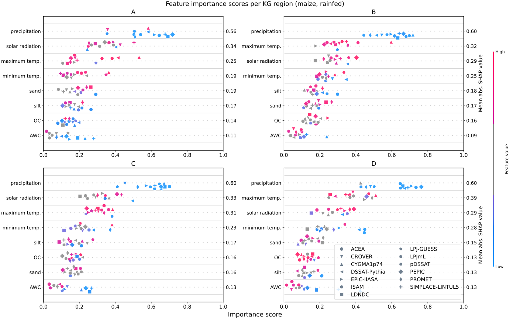
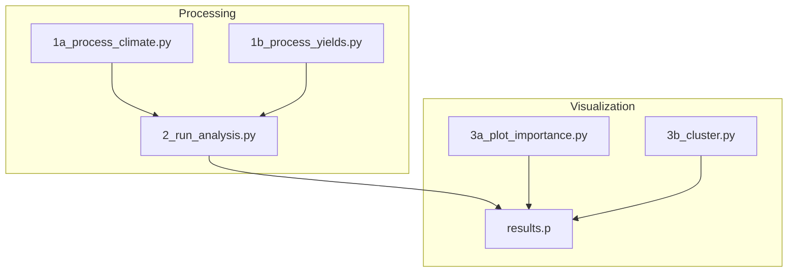

# Global Gridded Crop Model (GGCM) Feature Attribution

This repository provides the pipeline code for reproducing the comparative feature attribution study presented in the reference paper below.



## Pipeline

The pipeline processes climate and yield data of GGCMs, and combines it with auxiliary data from different sources (soil, site, Köppen-Geiger, harvested area, etc.).



A description of the proposed folder structure and auxiliary input data can be found [here](/data/input/README.md).

## Example

### [1a] Process climate data (per GGCM)

The first step converts binary[^1] climate data files into aggregated features used for attribution. `pdayfile` and `mdayfile` can be passed as paths to planting and maturity day NetCDFs. When omitted, the pipeline uses a biophysical growth model to estimate the growing season length.

```console
python pipeline\1a_process_climate.py 
--mdayfile /data/input/epic-iiasa_gswp3-w5e5_obsclim_2015soc_default_matyday-mai-firr_global_annual_1901_2016.nc 
--pdayfile /data/input/epic-iiasa_gswp3-w5e5_obsclim_2015soc_default_plantday-mai-firr_global_annual_1901_2016.nc 
--climdir /data/input/climate 
--locfile /data/input/CLIMATE_LAT_PD_HD_PHU_ELEV_PRMT74_mai_noirr_fH_v3c.csv  
--co2file /data/input/co2_historical_annual_1765_2014.txt 
--out /data/generated/climate_EPIC-IIASA_maize.h5
--year_from 1971 
--year_to 2015 
--shift 0 
--clim_year_from 1901 
--clim_year_to 2016 
```
[^1]: Folberth, C., Baklanov, A., Khabarov, N., Oberleitner, T., Balkovič, J. and Skalský, R., 2025. CROMES v1. 0: a flexible CROp Model Emulator Suite for climate impact assessment. Geoscientific Model Development, 18(17), pp.5759-5779.


### [1b] Process yield (per CCGM)

This step reads end-of-season yields per year, applies LOESS detrending and calculates relative yields.

```console
python pipeline\1b_process_yield.py 
--yieldfile /data/input/yield/ epic-iiasa_gswp3-w5e5_obsclim_2015soc_default_yield-mai-noirr_global_annual_1901_2016.nc
--mdayfile /data/input/epic-iiasa_gswp3-w5e5_obsclim_2015soc_default_matyday-mai-firr_global_annual_1901_2016.nc 
--pdayfile /data/input/epic-iiasa_gswp3-w5e5_obsclim_2015soc_default_plantday-mai-firr_global_annual_1901_2016.nc 
--out /data/generated/yield_EPIC-IIASA_maize.h5
--year_from 1971 
--year_to 2015 
--shift 0 
```

### [2] Analysis (multiple GGCMs)

The comparative feature attribution is performed in this step.

```console
python pipeline\2_run_analysis.py 
--datadir /data/generated 
--inputdir /data/input 
--out /data/output 
--crop maize 
--irr rf
--features default
--models EPIC-IIASA GGCM2 GGCM2 ...
```

Note that the analysis uses additional, auxiliary data. Filenames, if changed, can be adapted in the data loading section in `2_run_analysis.py`:

```python
data = analysis.load_data(
    file_climate=data_dir / f'climate_{model}_{crop}_{irr}.h5', 
    file_yield=data_dir / f'yield_{model}_{crop}_{irr}.h5',
    file_kg=input_dir / 'Beck_KG_V1_present_0p5.tif',
    file_spam=input_dir / f'spam2010V2r0_global_H_{crop.upper()}_R_30mn.tif',
    file_soil=input_dir / 'HWSD_soil_data_on_cropland_v2.3.nc',
    file_site=input_dir / 'CLIMATEID_SLP_GGCMI_LATLON.txt',   
)
```

Results for the selected models are stored in /data/output/results.p for further analysis and visualization.

### [3a] Importance score plots

```python
python pipeline\3a_plot_importance.py 
--results C:\Users\oberleitner\projects\anfos\ggcm-feature-importance\data\output\results.p 
--out C:\Users\oberleitner\projects\anfos\ggcm-feature-importance\data\output\importance.svg 
--crop corn 
--irr rf
```

### [3b] Clustering and dendrograms

```python
python pipeline\3b_cluster.py 
--results C:\Users\oberleitner\projects\anfos\ggcm-feature-importance\data\output\results.p 
--out C:\Users\oberleitner\projects\anfos\ggcm-feature-importance\data\output 
--crop corn 
--irr rf
```

## Reference Paper

Oberleitner, T., Folberth, C., et al., 2025. Explaining climatic drivers of yield anomalies in global crop models through metamodel-based attribution. Authorea Preprints. DOI: 10.22541/essoar.176071967.73925210/v1

## License

Licensed under the MIT license.

This project uses open-source software packages released under permissive licenses (BSD, MIT, Apache 2.0, MPL 2.0, PSF). Full license texts are available in the respective package distributions.